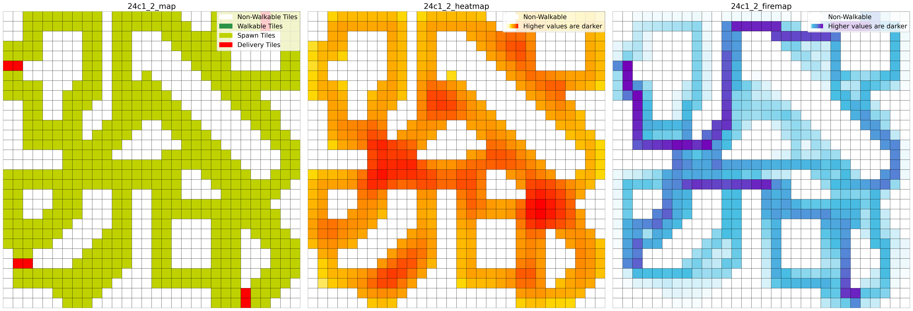
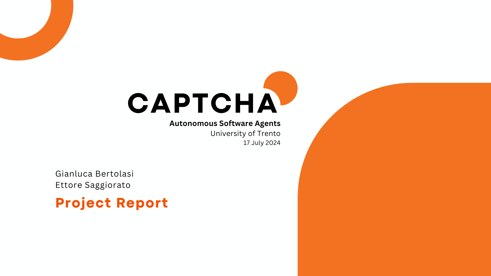

# Autonomous-Software-Agents-pvt repository
Project course of Autonomous Software Agents at University of Trento.

## Overview
This repository contains the code for the project of the course "Autonomous Software Agents" at the University of Trento. The project is about creating a multi-agent system that can navigate in a simulated environment, using the [Deliveroo.js](https://github.com/unitn-ASA/Deliveroo.js.git) framework. The agents are designed to work together to achieve their goals, and they use PDDL ([planutils](https://github.com/AI-Planning/planutils)) for planning their actions.

**Note**: The PDDL server has been dockerized to avoid problems with dependencies. By default it runs 2 planutils instances, loadbalanced with nginx. This can be changed in the `docker-compose.yml` file.

Agents can both be run in a single agent mode or in a multi-agent mode. In the multi-agent mode, agents work together to achieve their goals, and they can communicate with each other to coordinate their actions. The cooperative implementaton tries to find a plan that is optimal for the team, while blocking the best path for adversaries. This solution in kind of yielding, where the agents are willing to sacrifice their own performance for the sake of the team.

<p align="center">
</a>
</p>
<p align="center">
Example of map analysis. Green is the map. Orange (darker) representsthe best positions to visualize the spawning of new parcels. Blue (darker) represent the most traveled paths.
</p>

To have a better understanding of the maps, static analysis are performed to extract the statically most traveled paths. This information is used to create a heuristic that guides the agents in their planning process. The heuristic is based on the idea that the agents should avoid the most traveled paths, as they are likely to be more congested and less efficient. Also these paths are the ones that adversaries will use to reach their goal and are the ones that we want to block.

As the plans are generated by the PDDL server, to improve the performance of the agents, we implemented a caching system that stores the plans generated by the PDDL server. This allows the agents to reuse previously generated plans, which can significantly reduce the time required to generate new plans. Also a loadbalancing system is implemented to distribute the load of the PDDL server across multiple instances. This allows the agents to generate plans more quickly (lower response times) and efficiently, as they can take advantage of the available resources.

**Known issues**: there is a syncronization bug between agent and the deliveroo server. Sometimes commands are not responded by the server, probably due to a limitation of the server itself.  

<p align="center">
<a href="https://github.com/sa1g/autonomouse-softwae-agents/main/presentation.pdf"></a>
</p>
<p align="center">
Click to download slides
</p>


## Running the project

### 1. Installation
First of all clone the main branch of the repository:
```
git clone -b main https://github.com/sa1g/autonomous-software-agents-pvt.git
```
Then run this command:
```
npm install
```

### 2. Deliverooo Installation
In order to have a local server to test the maps, clone `Deliveroo` outside the workspace of this repository:
```
git clone https://github.com/unitn-ASA/Deliveroo.js.git
```
Now select the map that you prefer modifying the `config.js` file, and run this command:
```
npm run dev
```


### 3. PDDL Server

Open one terminal inside the repository workspace go inside the folder planutils using cd.
Then in order to run docker run this command:
```
docker-compose up
```


### 4. Single agent


If you want to test single agent case, you have to open a new terminal and from the workspace of the repository run this command:
```
npm run start-basic
```
NP: You have turn on the Deliveroo server (see section 2) before to start the agent

### 5. Multi agents

For the multi agent case, we decided to implement a master-slave method: the master runs around the map to collect packages, while the slave awaits in the best delivery path, blocking the passage to adversaries. This works following the general game theory idea, where every other agent will try to deliver and if the path is blocked, after some time, they search another path. This condition works well for some maps, on the other hand in others is better to run two single agents. Therefore three launch files are provided:
- `single_agent.ts`
- `collaborative_agent_1.ts`
- `collaborative_agent_1.ts` 

Two parameters need to be modified in the launch files:
- `<TOKEN>`: you get this when first logging the user in the Deliveroo server.
- `<TEAM_MATE_ID>`: used in the master-slave/collaborative agent case.

We suggent to open other two terminals.

On the first runs:
```
npm run start-agent1
```
On the other runs:
```
npm run start-agent2
```

NP: You have turn on the Deliveroo server (see section 2) before to start the agent


